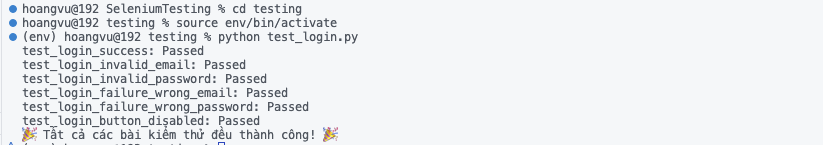

# Selenium Testing
 
## Mô tả dự án
Dự án này cung cấp một giao diện web đơn giản để thực hiện kiểm thử tự động bằng Selenium. Ứng dụng bao gồm một trang đăng nhập và một trang dashboard, kèm theo các kịch bản kiểm thử cơ bản để kiểm tra tính đúng đắn của chức năng đăng nhập.

## Cấu trúc dự án
```
├── frontend/ 
│   ├── css/ 
│   │   ├── dashboard.css 
│   │   └── login.css 
│   ├── html/
│   │   ├── dashboard.html 
│   │   └── login.css 
│   └── css/ 
│       ├── dashboard.css 
│       └── login.css
└── testing/
    ├── requirements.txt
    └── test_login.py
```

## Thiết lập dự án

### 1. Cài đặt các công cụ cần thiết
- Cài đặt Python (phiên bản >= 3.8).
- Trình duyệt Chrome hoặc Firefox.
- WebDriver tương ứng với trình duyệt (ví dụ: [ChromeDriver](https://sites.google.com/chromium.org/driver/) hoặc [GeckoDriver](https://github.com/mozilla/geckodriver)).

### 2. Tạo môi trường ảo
```bash
cd testing
python -m venv env
source env/bin/activate    # Trên Linux/macOS
env\Scripts\activate       # Trên Windows
```

### 3.  Cài đặt thư viện
```bash
pip install -r requirements.txt
```

## Chạy dự án

### 1. Chạy giao diện web
- Chạy với Live Server Extension trong Visual Studio Code
- URL mặc định: http://127.0.0.1:5500

### 2. Chạy các kịch bản kiểm thử
```bash
cd testing
source env/bin/activate    # Trên Linux/macOS
env\Scripts\activate       # Trên Windows
python test_login.py
```

## Mô tả chức năng
- Người dùng nhập email và mật khẩu để đăng nhập.
- Hiển thị lỗi nếu:
    - Email không hợp lệ.
    - Mật khẩu dưới 6 ký tự.
    - Thông tin đăng nhập sai.

## Kịch bản kiểm thử
- Kiểm thử đăng nhập thành công: Xác minh khi thông tin hợp lệ, người dùng được chuyển hướng sang dashboard.html.
- Kiểm thử sai định dạng email: Hiển thị lỗi khi email không đúng định dạng.
- Kiểm thử mật khẩu không hợp lệ: Hiển thị lỗi nếu mật khẩu dưới 6 ký tự.
- Kiểm thử đăng nhập thất bại: Hiển thị lỗi khi thông tin đăng nhập (email hoặc mật khẩu) sai.
- Kiểm thử nút đăng nhập bị vô hiệu hóa: Đảm bảo nút đăng nhập không hoạt động khi thông tin chưa đầy đủ.

## Kết quả kiểm thử
- Kết quả:



- Báo cáo:

|   | Kịch bản kiểm thử     | Kết quả    | Ghi chú
|---|-----------------------|------------|-----------------------------------------------------------------------------|
| 1 | Đăng nhập thành công  | Thành công | Chuyển hướng đến trang dashboard.html
| 2 | Sai định dạng email   | Thành công | Hiển thị lỗi: "Email không hợp lệ"
| 3 | Mật khẩu không hợp lệ | Thành công | Hiển thị lỗi: "Mật khẩu phải chứa ít nhất 6 ký tự"
| 4 | Sai thông tin đăng nhập | Thành công | Hiển thị lỗi: "Email hoặc mật khẩu không chính xác"
| 5 | Nút đăng nhập bị vô hiệu hóa | Thành công | Nút đăng nhập bị vô hiệu hóa khi chưa nhập đầy đủ thông tin đăng nhập

## Liên kết ChatGPT
[ChatGPT](https://chatgpt.com/share/678683af-4444-8001-ac2d-c123a9ded6ba)